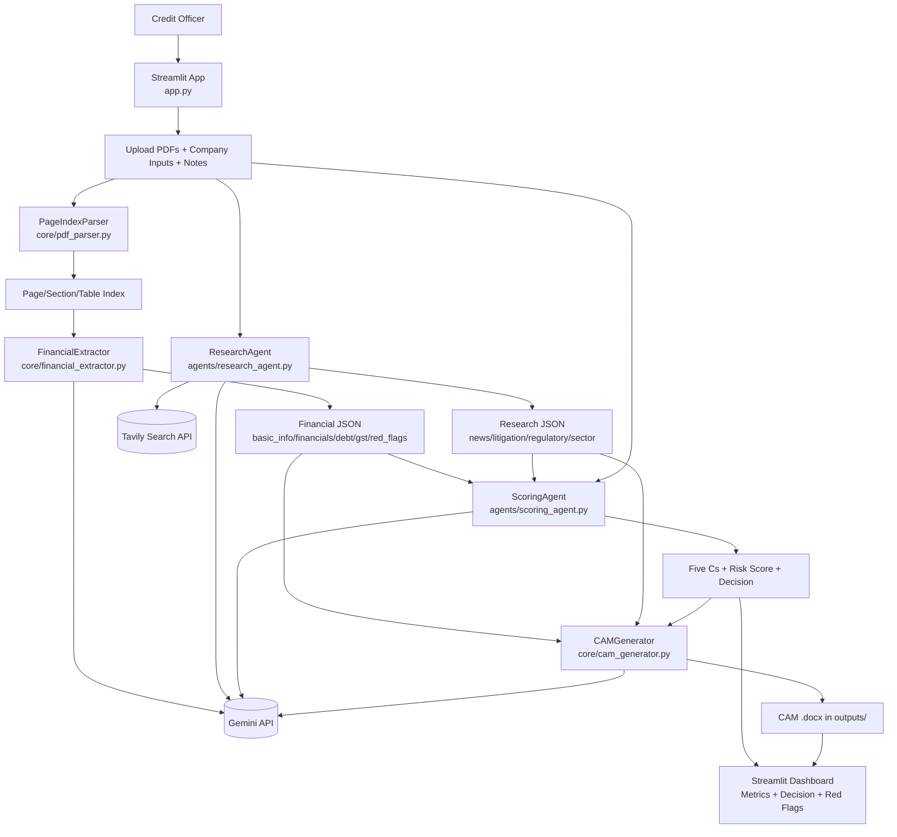

# Vivrity - Intelli-Credit (AI-Powered Credit Appraisal)

Multi-agent credit appraisal system for Indian NBFC workflows.

It ingests company PDFs, extracts financial and risk signals, performs external intelligence research, computes Five Cs scoring, and generates a professional CAM (Credit Appraisal Memorandum) in `.docx` format.

## What This Project Does

- Parses uploaded PDFs using a vectorless page-index approach (no embeddings, no vector DB).
- Extracts key company and financial fields with Gemini.
- Runs web research using Tavily + Gemini synthesis.
- Computes Five Cs scores and risk-based recommendation.
- Generates a bank-style CAM document for decisioning.

## Tech Stack

- Frontend/UI: `streamlit`
- LLM: `google-generativeai` (Gemini, currently `gemini-2.5-flash` in code)
- Search: `tavily-python`
- PDF Parsing: `pdfplumber`, `PyMuPDF`
- CAM Generation: `python-docx`
- Runtime: Python `>=3.10`

## Project Structure

```text
app.py                      # Streamlit app / orchestrator
main.py                     # Minimal local entrypoint
core/
	pdf_parser.py             # PageIndexParser + vectorless query
	financial_extractor.py    # Financial extraction (Gemini)
	cam_generator.py          # CAM .docx generation
agents/
	research_agent.py         # External intelligence + synthesis
	scoring_agent.py          # Five Cs + final risk/reco
prompts/
	cam/                      # CAM writing template
	ingestor/                 # Ingestion extraction prompts
	research/                 # Research prompts
	scoring/                  # Five Cs + recommendation prompts
utils/
	prompt_loader.py          # Prompt template loading
outputs/                    # Generated CAM files
```

## Architecture



## End-to-End Flow

1. Upload one or more PDFs and enter company details.
2. `PageIndexParser` builds page/section/financial index.
3. `FinancialExtractor` does a single consolidated extraction call.
4. `ResearchAgent` runs Tavily searches and one consolidated synthesis call.
5. `ScoringAgent` computes Five Cs, penalties, and recommendation.
6. `CAMGenerator` writes a formal CAM `.docx`.
7. Dashboard shows decision, rationale, risk signals, and download link.

## Setup

### 1) Clone and install

```bash
# using uv (recommended)
uv sync

# or pip
pip install -r requirements.txt
```

### 2) Environment variables

Create `.env` in project root:

```env
GEMINI_API_KEY=your_gemini_api_key
TAVILY_API_KEY=your_tavily_api_key
```

### 3) Run

```bash
streamlit run app.py
```

Then open the URL shown by Streamlit in your browser.

## Cost Analysis (Including Cost Per PDF Page)

This project has two cost buckets:

- Local compute cost: PDF parsing/indexing (`pdfplumber`, `PyMuPDF`) -> no API charge.
- API cost:
	- Gemini calls for extraction, research synthesis, scoring, and CAM writing.
	- Tavily calls for web search (research stage).

Important behavior from code: extraction uses top relevant pages (`pages[:5]`), so cost does not scale linearly with very high page counts.

## Cost Formula

Let:

- `P` = pages in input PDF
- `R_in` = Gemini input price per 1M tokens
- `R_out` = Gemini output price per 1M tokens
- `T_in(P)` = total input tokens for full run
- `T_out(P)` = total output tokens for full run
- `N_search` = Tavily searches (typically 4 to 5)
- `R_search` = Tavily price per search

Then:

```text
C_total(P) = (T_in(P)/1,000,000)*R_in + (T_out(P)/1,000,000)*R_out + N_search*R_search
Cost per page(P) = C_total(P) / P
```

## Practical Token Approximation

For this pipeline, a useful approximation is:

- `T_in(P) ~= T_fixed_in + T_page_in * min(P, 5)`
- `T_out(P) ~= T_fixed_out`

Reason: financial extraction prompt injects only top 5 relevant pages, while scoring/CAM/research calls are mostly fixed-size per run.

## Example Cost Table (Illustrative)

Use these example assumptions (replace with your actual vendor pricing):

- `R_in = $0.15 / 1M tokens`
- `R_out = $0.60 / 1M tokens`
- `T_in(P) = 12,000 + 600*min(P, 5)`
- `T_out(P) = 4,500`
- `N_search = 5`
- `R_search = $0.008`

With these assumptions:

- `C_total(P) = LLM_cost(P) + $0.040` (Tavily)
- LLM-only is typically around half a cent per case.

| Input PDF Pages (P) | Estimated Total Cost per Case (USD) | Effective Cost per Page (USD/page) |
|---:|---:|---:|
| 5 | $0.0449 | $0.00898 |
| 10 | $0.0449 | $0.00449 |
| 25 | $0.0449 | $0.00180 |
| 50 | $0.0449 | $0.00090 |
| 100 | $0.0449 | $0.00045 |

Interpretation:

- Total case cost remains nearly flat because most calls are fixed per case.
- Effective per-page cost falls as document length increases.

## Cost Sensitivity Notes

- If Tavily pricing changes, overall cost moves significantly (web search can dominate).
- If you switch Gemini model tier, `R_in`/`R_out` can materially change cost.
- If you increase extracted pages beyond top 5, per-case LLM input cost rises.

## Quick Recalculation Template

Use this mini formula with your live rates:

```text
LLM_cost(P) = ((12000 + 600*min(P,5))/1e6)*R_in + (4500/1e6)*R_out
Total_cost(P) = LLM_cost(P) + 5*R_search
Per_page(P) = Total_cost(P)/P
```

## Outputs

- Real-time dashboard with:
	- Credit decision (`APPROVE`, `CONDITIONAL_APPROVE`, `REJECT`)
	- Final score and rating
	- Five Cs breakdown
	- Red flags and risk signals
- Downloadable CAM Word document:
	- `outputs/CAM_<company>_<timestamp>.docx`

## Current Limitations

- `agents/ingestor_agent.py`, `agents/cam_agent.py`, and `utils/indian_context.py` are currently placeholders/empty.
- No persisted database layer yet; run state is held in Streamlit session state.
- API pricing in this README is illustrative; verify with live provider pricing before production budgeting.

## Future Enhancements

- Add explicit token/cost logging per stage for real-time cost telemetry.
- Add batch processing mode with aggregated cost dashboard.
- Introduce configurable pricing file (`config/pricing.yaml`) for deterministic costing.

## License

Add your project license here.
